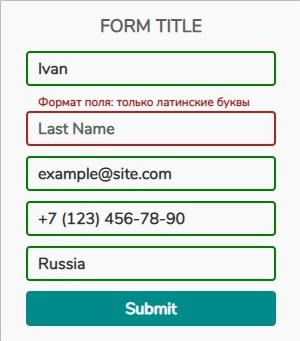
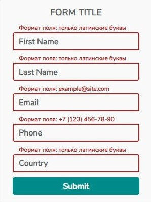
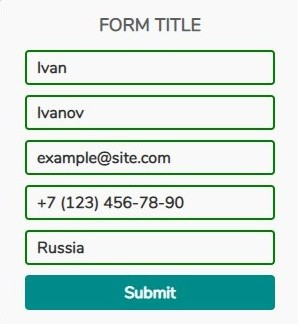
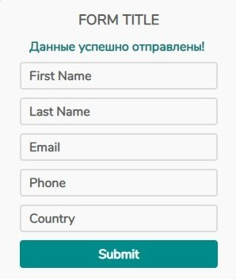

# Form

Web-форма с валидацией на стороне клиента.

Для просмотра проекта перейдите по ссылке: https://burlakovep.github.io/Form/

Вид формы по умолчанию:

Валидация производится при потере полем фокуса или при нажатии на кнопку "Submit". Если в форму введены некорректные данные, появляется подсказка и подсвечивается соответствующее поле (поля):

Если в форму введены корректные данные, поля подсвечиваются зеленым цветом:

При нажатии на кнопку "Submit" появляется сообщение об успешной отправке данных (об успешной валидации).

